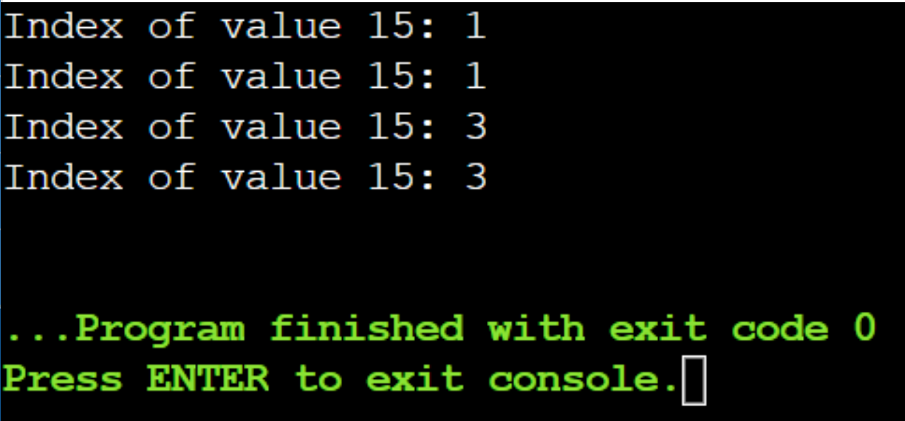

# Лабораторная работа №2
# Отчет по первой лабораторной работе

1. [Инструкции по запуску проекта](#1-инструкции-по-запуску-проекта).
2. [Описание программы](#2-описание-программы).
3. [Функции поиска](#3-функции-поиска).
4. [Примеры использования проекта с приложением скриншотов или фрагментов кода](#4-пример-использования-проекта-с-приложением-скриншотов).

## 1. Инструкции пользователя
Убедитесь, что ваш компилятор поддерживает C++20 из-за использования std::span.
Для использования программы не требуются внешние зависимости.
Программа собирается и запускается со стандартными командами компиляции и выполнения для вашей среды разработки.

## 2. Описание программы
Программа демонстрирует использование различных методов поиска в данных: линейный поиск, бинарный поиск, интерполяционный поиск, а также поиск по бинарному дереву. Каждый метод поиска имплементирован в виде отдельной функции, которая принимает массив или дерево, а также ключ поиска, и возвращает индекс элемента с этим ключом или указатель на узел дерева.

## 3. Функции поиска
1.Линейный поиск (linear_search):
Принимает массив элементов и ключ, возвращает индекс первого элемента, равного ключу, или -1, если элемент не найден.
Метод работает за линейное время и не требует от данных быть упорядоченными.
2.Бинарный поиск (binary_search):
Принимает упорядоченный массив элементов и ключ, возвращает индекс элемента с этим ключом или -1, если элемент не найден.
Метод эффективен для упорядоченных массивов и работает за логарифмическое время.
3.Интерполяционный поиск (interpolation_search):
Принимает упорядоченный массив элементов и ключ, возвращает индекс элемента с этим ключом или -1, если элемент не найден.
Метод подходит для равномерно распределенных данных, может быть быстрее бинарного поиска в определенных условиях.
4.Поиск по бинарному дереву (binary_tree_search):
Принимает корень бинарного дерева и ключ, возвращает указатель на узел с данным ключом или nullptr, если такой узел отсутствует.
Метод эффективен, если дерево балансировано.

## 4. Пример работы программы
В функции main создаются неупорядоченный и упорядоченный массивы, бинарное дерево, после чего демонстрируется использование всех методов поиска для нахождения индекса элемента 15. Для каждого метода выводятся результаты его работы.

