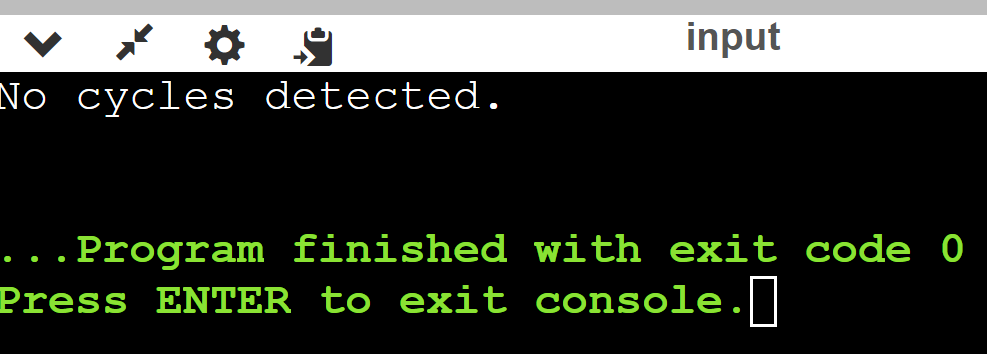

# Лабораторная работа №3
# Отчет по третьей лабораторной работе

1. [Инструкции пользователя](#1-инструкции-пользователя).
2. [Описание программы](#2-описание-программы).
3. [Функции](#3-функции-поиска).
4. [Примеры использования](#4-пример-использования).

## 1. Инструкции пользователя
Для компиляции и запуска проекта используйте следующие команды:

```bash
g++ -o program lab3.cpp./program
```

## 2. Описание программы
Этот проект включает в себя реализацию двух основных структур данных на языке C++: односвязного и двусвязного списка, а также хеш-таблицы с использованием метода цепочек для разрешения коллизий.


## 3. Функции 

### Односвязный Список

- `insertAfter`: Добавляет элемент после заданного узла.
- `find`: Ищет элемент с заданным значением и возвращает узел.
- `removeAfter`: Удаляет элемент, следующий за заданным узлом.
- `assertNoCycles`: Проверяет список на наличие циклов.

### Двусвязный Список

- `insertAfter`: Добавляет элемент после заданного узла.
- `insertBefore`: Добавляет элемент перед заданным узлом.
- `find`: Ищет элемент по значению.
- `remove`: Удаляет заданный узел.
- `assertNoCycles`: Проверяет на наличие циклов.

### Хеш-Таблица

- `add`: Добавляет элемент с заданным ключом.
- `find`: Ищет элемент по ключу.
- `remove`: Удаляет элемент по ключу.
- `freeHashTable`: Освобождает память, занятую хеш-таблицей.


## 4. Пример использования
В функции main() демонстрируется использование различных функций для работы со структурами данных, такими как односвязный список и хеш-таблица.

```cpp 
int main() {
    LinkedList<int> myList;

    // Тестирование добавления элементов
    Node<int>* first = insertAfter(myList, static_cast<Node<int>*>(nullptr), 10); // Добавить в начало
    insertAfter(myList, first, 20); // Добавить после первого узла
    insertAfter(myList, static_cast<Node<int>*>(nullptr), 5); // Добавить в начало

    // Тестирование поиска
    FindNodeResult<int> result = find(myList, 20);
    std::cout << "Found: " << (result.foundNode ? result.foundNode->value : -1) << std::endl;

    // Тестирование удаления
    removeAfter(myList, first); // Удалить узел после первого узла
    removeAfter(myList, static_cast<Node<int>*>(nullptr)); // Удалить первый узел

    // Проверка на отсутствие циклов
    assertNoCycles(myList);

    return 0;
}
```
Для двусвязного списка
```cpp
int main() {
        LinkedList list;
    Node* n1 = insertAfter(&list, nullptr, 10);
    Node* n2 = insertAfter(&list, n1, 20);
    Node* n3 = insertBefore(&list, n1, 5);

    assert(find(&list, 10) == n1);
    assert(find(&list, 20) == n2);
    assert(find(&list, 5) == n3);

    remove(&list, n1);
    assert(find(&list, 10) == nullptr);

    try {
        assertNoCycles(&list);
        std::cout << "No cycles detected." << std::endl;
    } catch (std::exception& e) {
        std::cout << e.what() << std::endl;
    }
    return 0;
}
```
## Для односвязного списка

## для двусвязного списка

