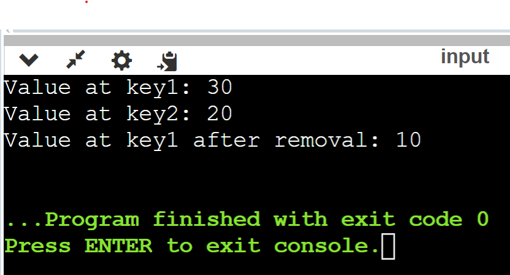

# Лабораторная работа №6
# Отчет по первой лабораторной работе

1. [Инструкции пользователя](#1-инструкции-пользователя).
2. [Описание программы](#2-описание-программы).
3. [Функции](#3-функции).
4. [Примеры использования](#4-пример-использования).

## 1. Инструкции пользователя
Убедитесь, что ваш компилятор поддерживает C++17 из-за использования std::span.
Для компиляции и запуска программы используйте следующую команду:
g++ -std=c++17 -o hashtable lab6.cpp./hashtable


## 2. Описание программы
Программа демонстрирует использование различных методов поиска в данных: линейный поиск, бинарный поиск, интерполяционный поиск, а также поиск по бинарному дереву. Каждый метод поиска имплементирован в виде отдельной функции, которая принимает массив или дерево, а также ключ поиска, и возвращает индекс элемента с этим ключом или указатель на узел дерева.
`HashTable` - Основная структура хеш-таблицы.

`BucketNode` - Узел, содержащий ключ, значение и указатель на следующий узел в случае коллизии.

## 3. Функции 
`createHashTable` - Создаёт хеш-таблицу с заданной вместимостью.
`add` - Добавляет новый элемент в хеш-таблицу. В случае коллизии элемент добавляется в начало связанного списка.
`find` - Ищет элемент по ключу и возвращает указатель на значение, если ключ найден.
`remove` - Удаляет элемент по ключу.


## 4. Пример использования
В функции main()  происходит демонстрация работы созданной ранее хеш-таблицы, которая использует строковые ключи для хранения целочисленных значений. 

```cpp int main() {
    auto table = createHashTable<int>(10, simpleHash);

    add(table, "key1", 10);
    add(table, "key2", 20);
    add(table, "key1", 30);

    std::cout << "Value at key1: " << *find(table, "key1") << std::endl;  // Output: 30
    std::cout << "Value at key2: " << *find(table, "key2") << std::endl;  // Output: 20

    remove(table, "key1");
    std::cout << "Value at key1 after removal: " << (find(table, "key1") ? std::to_string(*find(table, "key1")) : "not found") << std::endl;  // Output: not found

    return 0;
} 
```

